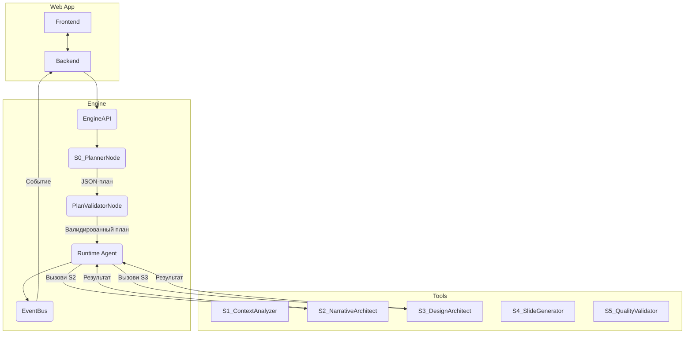

# Спецификация Архитектуры Движка

**Версия:** 3.0
**Дата:** 2026-02-23
**Статус:** Финальная версия

> Этот документ является **единственным источником правды** по архитектуре движка. Он объединяет и полностью заменяет собой `engine_architecture_specification_v2_ru.md` и `engine_specification_v3_additions.md`. Для разработки достаточно только этого документа.

---

## 1. Цели и границы системы

Этот документ описывает архитектуру **универсального, управляемого LLM-планировщиком движка v3.0**, предназначенного для выполнения сложных, многошаговых задач и интегрированного с веб-приложением через real-time API.

- **Гибкость:** Способность выполнять динамические планы, сгенерированные LLM.
- **Надёжность:** Гарантированное получение структурированных, валидируемых данных от LLM.
- **Наблюдаемость:** Прозрачная трансляция событий для отладки и отображения в UI.
- **Расширяемость:** Простое добавление новых «инструментов» (Node).
- **Интегрированность:** Наличие публичного API для интеграции с Backend, поддержки ручных правок и отмены выполнения.

## 2. Архитектура

Архитектура основана на концепции **интеллектуального оркестратора**.

1.  **`EngineAPI`**: Публичный интерфейс для Backend.
2.  **`S0_PlannerNode`**: LLM-агент, преобразующий запрос пользователя в JSON-план.
3.  **`PlanValidatorNode`**: Проверяет план на корректность.
4.  **`RuntimeAgent`**: Выполняет шаги из плана, вызывая «инструменты» (S1-S5).
5.  **`EventBus`**: Транслирует события о ходе выполнения наружу.



## 3. EngineAPI

`EngineAPI` — единственная точка входа для взаимодействия Backend с движком. Он инкапсулирует весь жизненный цикл.

```python
from typing import Any, Dict, List, Optional
import asyncio

class EngineAPI:
    def __init__(self, config_path: str = "configs/config.yaml"):
        # ... инициализация planner, validator, registry, event_bus, file_storage ...
        self._cancellation_tokens: Dict[str, asyncio.Event] = {}

    async def run(
        self,
        project_id: str,
        user_input: Dict[str, Any],
        chat_history: List[Dict[str, Any]],
        existing_results: Optional[Dict[str, Any]] = None,
        attached_files: Optional[List[Dict[str, Any]]] = None
    ) -> SharedStore:
        """Основной метод: выполнить задачу."""
        # 1. Создать SharedStore
        # 2. Создать и сохранить cancel_token
        # 3. Вызвать S0_PlannerNode
        # 4. Вызвать PlanValidatorNode
        # 5. Вызвать RuntimeAgent
        # 6. Вернуть финальный SharedStore
        pass

    async def apply_edit(
        self,
        project_id: str,
        artifact_id: str,
        new_content: str,
        chat_history: List[Dict[str, Any]],
        existing_results: Dict[str, Any]
    ) -> SharedStore:
        """Обработать ручную правку артефакта."""
        # 1. Восстановить SharedStore
        # 2. Сформировать специальный user_input для S0
        # 3. Вызвать S0, Validator, RuntimeAgent
        pass

    async def cancel(self, project_id: str) -> bool:
        """Отменить текущее выполнение для проекта."""
        token = self._cancellation_tokens.get(project_id)
        if token:
            token.set()
            return True
        return False
```

## 4. Общее Хранилище (SharedStore)

`SharedStore` — Pydantic-модель, единственный источник правды о состоянии задачи.

- **`results`** (`Dict[str, Any]`) — хранит **структурированные JSON-данные**, результат работы каждого узла (контекст S1, нарратив S2).
- **`artifacts`** (`List[Artifact]`) — хранит **метаданные файлов** (`structure.md`, `presentation.html`).

```python
from pydantic import BaseModel, Field
from typing import Any, Dict, List, Optional
from datetime import datetime
from enum import Enum

class ProjectStatus(str, Enum):
    PENDING = "pending"
    PLANNING = "planning"
    EXECUTING = "executing"
    SUCCESS = "success"
    FAILED = "failed"
    CANCELLED = "cancelled"

class ChatMessage(BaseModel):
    role: str
    content: str

class AttachedFile(BaseModel):
    file_id: str
    filename: str
    path: str

class Artifact(BaseModel):
    artifact_id: str
    filename: str
    storage_path: str
    version: int = 1
    created_by: str

class SharedStore(BaseModel):
    project_id: str
    status: ProjectStatus = ProjectStatus.PENDING
    user_input: Dict[str, Any]
    config: Dict[str, Any]
    chat_history: List[ChatMessage] = Field(default_factory=list)
    attached_files: List[AttachedFile] = Field(default_factory=list)
    execution_plan: Dict[str, Any] | None = None
    plan_validation_errors: List[str] | None = None
    results: Dict[str, Any] = Field(default_factory=dict)
    artifacts: List[Artifact] = Field(default_factory=list)
    errors: List[Dict[str, Any]] = Field(default_factory=list)

    def to_json(self) -> str:
        return self.model_dump_json()

    @classmethod
    def from_json(cls, json_str: str) -> "SharedStore":
        return cls.model_validate_json(json_str)
```

## 5. Система событий (EventBus)

`EventBus` транслирует события о ходе выполнения для Backend и WebSocket.

```python
class EventType(str, Enum):
    PLAN_STARTED = "plan_started"
    STEP_STARTED = "step_started"
    STEP_COMPLETED = "step_completed"
    ARTIFACT_CREATED = "artifact_created"
    ERROR = "error"
    AI_MESSAGE = "ai_message"

class EngineEvent(BaseModel):
    event_type: EventType
    trace_id: str
    component: str
    message: str
    data: Optional[Dict[str, Any]] = None

class EventBus:
    def __init__(self):
        self._subscribers: Dict[EventType, List[Callable]] = {}

    def subscribe(self, event_type: EventType, subscriber: Callable):
        self._subscribers.setdefault(event_type, []).append(subscriber)

    async def emit(self, event: EngineEvent):
        subscribers = self._subscribers.get(event.event_type, [])
        for sub in subscribers:
            await sub(event)
```

## 6. Описание узлов (Nodes)

### 6.1. Системные узлы

- **`S0_PlannerNode`**: LLM-узел. Преобразует запрос пользователя в исполняемый JSON-план. Формирует **динамический промпт**, который включает:
    - **Статическую часть:** Роль, инструкции, описание доступных инструментов.
    - **Динамическую часть:** Запрос пользователя, историю чата, результаты предыдущих шагов.
    - **Расширение для ручных правок:** Если в `user_input` есть `edit_context`, промпт дополняется инструкцией проанализировать правку.
- **`PlanValidatorNode`**: Не-LLM узел. Проверяет сгенерированный план на корректность (существуют ли вызываемые узлы, правильные ли у них зависимости).

### 6.2. Инструментальные узлы (S1-S5)

- **`S1_ContextAnalyzerNode`**: Расширен для работы с `attached_files`. Извлекает из них текст и добавляет в `results`.
- **`S2_NarrativeArchitectNode`**: Генерирует `structure.md`.
- **`S3_DesignArchitectNode`**: Выбирает дизайн-пресет.
- **`S4_SlideGeneratorNode`**: Генерирует `presentation.html`.
- **`S5_QualityValidatorNode`**: Проверяет качество.

## 7. Интеграция с LLM

Интеграция с LLM централизована через библиотеку `Instructor` для **всех** вызовов LLM в системе, что обеспечивает надёжность и получение валидированных Pydantic-моделей.

- **В `S0_PlannerNode`:** Гарантирует, что LLM вернёт план, соответствующий `ExecutionPlanSchema`.
- **В `ToolNode` (S1-S5):** Гарантирует, что LLM вернёт результат, соответствующий Pydantic-модели этого шага.

`Instructor` берёт на себя форматирование схемы, парсинг, валидацию и **автоматические повторные попытки** в случае ошибки валидации.

## 8. Pydantic-модели (План)

`ExecutionPlanSchema` определяет структуру плана, генерируемого `S0_PlannerNode`.

```python
class PlanStep(BaseModel):
    step_id: int
    node: str = Field(..., description="Имя вызываемого ToolNode")
    params: Dict[str, Any] = Field(default_factory=dict)
    reason: str = Field(..., description="Объяснение, почему этот шаг необходим")

class ExecutionPlanSchema(BaseModel):
    thought: str = Field(..., description="Пошаговое рассуждение LLM")
    steps: List[PlanStep]
```

## 9. RuntimeAgent

`RuntimeAgent` — основной цикл движка, исполняющий план. Расширен для поддержки `EventBus` и `cancel_token`.

```python
class RuntimeAgent:
    def __init__(self, registry: ToolRegistry, event_bus: EventBus, file_storage: FileStorage, cancel_token: asyncio.Event):
        # ...

    async def execute(self, shared_store: SharedStore) -> SharedStore:
        for step in shared_store.execution_plan.steps:
            if self.cancel_token.is_set():
                # ... обработка отмены ...
                break
            # ... emit STEP_STARTED ...
            # ... выполнение шага ...
            # ... emit STEP_COMPLETED ...
        return shared_store
```

## 10. Логирование

Система логирования становится подписчиком `EventBus`. Каждая запись лога содержит `trace_id`.

```json
{
  "timestamp": "2026-02-23T10:00:00.123Z",
  "level": "INFO",
  "trace_id": "uuid-1234-abcd",
  "component": "S0_PlannerNode",
  "event": "plan_generated",
  "message": "План успешно сгенерирован"
}
```

## 11. Обработка ошибок

Трёхуровневая система обработки ошибок:
1.  **Ошибки LLM (`Instructor`):** Автоматические повторные попытки при невалидном JSON.
2.  **Ошибки API (`API Client`):** Повторные попытки с экспоненциальной задержкой и переключением на резервного провайдера.
3.  **Ошибки исполнения (`RuntimeAgent`):** Прерывание выполнения, запись ошибки в `SharedStore.errors`, статус `failed`.

## 12. Конфигурация

Файл `config.yaml` содержит настройки LLM-провайдеров, планировщика и движка.

```yaml
llm:
  default_provider: "gemini"
  providers:
    gemini:
      api_key: "${GEMINI_API_KEY}"
      model: "gemini-2.5-flash"

planner:
  provider: "gemini"
  model: "gemini-2.5-flash"

engine:
  max_execution_steps: 10

chat:
  max_history_messages: 20
  max_file_size_mb: 10
```

## 13. FileStorage

Абстракция для работы с файлами (локальная ФС или S3).

```python
from abc import ABC, abstractmethod

class FileStorage(ABC):
    @abstractmethod
    async def save(self, path: str, content: bytes) -> str:
        ...
    @abstractmethod
    async def load(self, path: str) -> bytes:
        ...
```

## 14. Механизм ручных правок

Реализуется через `EngineAPI.apply_edit()`. `S0_PlannerNode` получает `edit_context` и генерирует план для перегенерации **только зависимых** артефактов.

## 15. Отмена выполнения

Реализована через `asyncio.Event` и метод `EngineAPI.cancel()`. `RuntimeAgent` проверяет токен перед каждым шагом.

## 16. Событие AI_MESSAGE

Событие `AI_MESSAGE` используется для отправки текстовых сообщений от движка в чат пользователя в ключевых точках: после генерации плана, после завершения шага, при итоговом сообщении или при ошибке.

## 17. Сквозной сценарий

1.  **Frontend → Backend:** `user_message`
2.  **Backend → Engine:** `engine.run()`
3.  **Engine → Backend:** `EventBus` транслирует события `STEP_STARTED`, `ARTIFACT_CREATED`.
4.  **Backend → Frontend:** WebSocket-сообщения `status_update`, `artifact_generated`.
5.  **Backend → DB:** Сохраняет финальный `SharedStore`.

## 18. Файловая структура

```
/engine/
  ├── api.py
  ├── runtime.py
  ├── registry.py
  ├── event_bus.py
  ├── file_storage.py
  └── nodes/
      ├── base_node.py
      ├── planner_node.py
      └── validator_node.py
/tools/
  ├── s1_analyzer.py
  └── ...
/schemas/
  ├── shared_store.py
  ├── execution_plan.py
  ├── events.py
  └── tool_schemas.py
/configs/
  └── config.yaml
```

## 19. Тестирование

-   **Unit-тесты:** Тестирование каждого `ToolNode` в изоляции, а также `S0_PlannerNode` и `PlanValidatorNode`.
-   **Integration-тесты:** Тестирование связки `Planner` → `Validator` → `RuntimeAgent` и полного CJM с реальными вызовами LLM.
