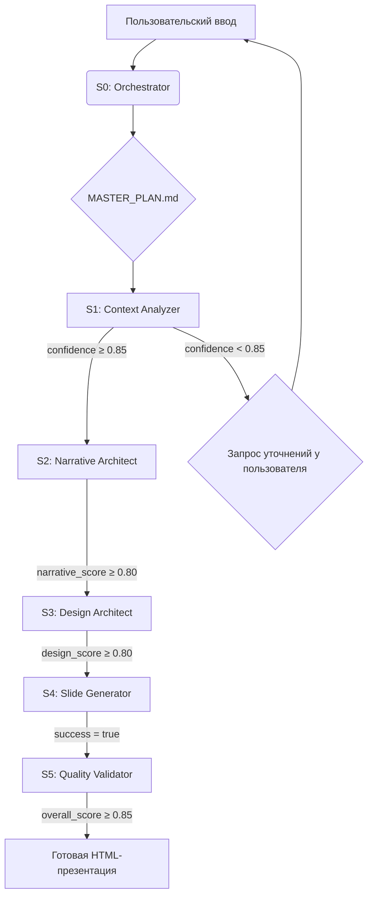

# Техническая спецификация: Система генерации презентаций

**Версия документа:** 1.0
**Дата:** 2026-02-19
**Автор:** Manus AI (на основе анализа артефактов)

## 1. Введение

Настоящий документ представляет собой исчерпывающее техническое описание системы генерации HTML5-презентаций, далее именуемой «Система». Документ создан в результате реверс-инжиниринга артефактов, предоставленных в архиве `presentation.zip`, и предназначен для разработчиков, системных аналитиков и архитекторов с целью понимания архитектуры, принципов работы и внутреннего устройства Системы.

### 1.1. Назначение и цели Системы

Основное назначение Системы — автоматизированное создание профессиональных, визуально консистентных и содержательно структурированных презентаций в формате HTML5. Система решает следующие ключевые задачи:

-   **Структурирование контента:** Преобразование необработанного пользовательского ввода (текст, идеи, данные) в логичную повествовательную структуру.
-   **Применение дизайн-системы:** Автоматическое применение сложной, но строгой визуальной системы, основанной на принципах **Международного типографического стиля (Swiss Style)**.
-   **Генерация артефактов:** Создание готовых к использованию HTML-файлов слайдов, объединенных в единую презентацию.
-   **Обеспечение качества:** Многомерный контроль качества на каждом этапе производственного конвейера.
-   **Итеративные улучшения:** Предоставление механизмов для последующей доработки и креативной трансформации сгенерированных слайдов.

### 1.2. Ключевые принципы и философия

В основе Системы лежат три фундаментальных принципа:

1.  **Модульность и специализация:** Система построена на архитектуре взаимодействующих, но независимых модулей (далее «скиллов»), каждый из которых отвечает за узкоспециализированную задачу (например, анализ контекста, дизайн нарратива, генерация кода). Это обеспечивает гибкость и простоту поддержки.
2.  **Управление через состояние:** Центральным элементом архитектуры является файл состояния `MASTER_PLAN.md`, который выступает в роли «единого источника правды». Каждый скилл читает данные из этого файла и записывает в него результат своей работы, передавая управление следующему звену в конвейере. Это делает процесс детерминированным и легко отлаживаемым.
3.  **Качество через ограничения (Quality through Constraints):** Дизайн-система намеренно накладывает строгие ограничения (сетка, типографика, цветовые палитры, правила отступов), основанные на принципах Swiss Style. Философия Системы гласит: **«Ограничения освобождают креативность»**. Предоставляя жесткую структуру, Система позволяет генеративному ИИ принимать смелые и уверенные дизайнерские решения в рамках заданных правил, избегая хаоса и визуального шума.

### 1.3. Обзор архитектуры

Система представляет собой **конвейер (pipeline)**, управляемый центральным **оркестратором** (`presentation-orchestrator`). Процесс генерации презентации разделен на пять последовательных этапов (S1-S5), каждый из которых реализуется отдельным скиллом. Между этапами установлены **«врата качества» (Quality Gates)** — условия, которые должны быть выполнены для перехода к следующему шагу.

Высокоуровневая схема работы выглядит следующим образом:

Помимо основного конвейера, Система включает в себя вспомогательные (auxiliary) скиллы для итеративной доработки, генерации визуальных ассетов и экспорта в PDF, которые могут вызываться независимо.
## 2. Компоненты Системы

Система состоит из команд (точек входа), основных и вспомогательных скиллов, а также обширной базы знаний (knowledge base) и шаблонов.

### 2.1. Команды (Commands)

Команды являются точками входа, которые инициируют рабочие процессы. Они определены в директории `.claude/commands/`.

| Команда | Файл | Описание |
| :--- | :--- | :--- |
| `/presentation` | `presentation.md` | **Основная точка входа.** Запускает скилл-оркестратор `presentation-orchestrator` для создания или доработки презентации. |
| `/html2pdf` | `html2pdf.md` | **(DEPRECATED)** Конвертирует HTML-слайды в PDF 16:9. Функциональность перенесена в одноименный скилл. |
| `/html2pdf-a4` | `html2pdf-a4.md` | **(DEPRECATED)** Конвертирует HTML-слайды в PDF формата A4. Функциональность перенесена в одноименный скилл. |

### 2.2. Основные скиллы (Core Skills)

Это скиллы, составляющие ядро конвейера генерации презентаций.

#### 2.2.1. `presentation-orchestrator`

-   **Файл:** `.claude/skills/presentation-orchestrator/SKILL.md`
-   **Назначение:** Главный управляющий скилл. Координирует вызов всех остальных скиллов (S1-S5), управляет состоянием проекта через `MASTER_PLAN.md` и обрабатывает итеративные запросы на доработку.
-   **Логика работы:**
    1.  Инициализирует проект: создает директорию в `projects/` и копирует в нее шаблон `master_plan_template.md`.
    2.  Последовательно вызывает скиллы S1-S5.
    3.  После каждого вызова проверяет «врата качества». Если проверка не пройдена, останавливает процесс и запрашивает у пользователя дальнейшие действия.
    4.  Обрабатывает запросы на доработку (`refinements`), маршрутизируя их на соответствующие скиллы (например, `design-refine` для изменений дизайна).

#### 2.2.2. `context-analyzer` (S1)

-   **Файл:** `.claude/skills/context-analyzer/SKILL.md`
-   **Назначение:** Анализ и структурирование первоначального запроса пользователя.
-   **Логика работы:**
    1.  Читает секцию `User Input` из `MASTER_PLAN.md`.
    2.  Извлекает 8 ключевых полей контекста: `audience`, `purpose`, `presentation_type`, `duration`, `tone`, `key_messages`, `preferred_theme`, `slide_numbering`, `content_mode`.
    3.  Рассчитывает `confidence_score` (от 0 до 1.0), отражающий полноту и однозначность входных данных.
    4.  Если `confidence_score < 0.85`, генерирует уточняющие вопросы к пользователю.
    5.  Записывает структурированный JSON с результатами анализа в секцию `S1: Context Analysis` в `MASTER_PLAN.md`.
-   **Врата качества:** `confidence_score >= 0.85`.

#### 2.2.3. `narrative-architect` (S2)

-   **Файл:** `.claude/skills/narrative-architect/SKILL.md`
-   **Назначение:** Проектирование повествовательной структуры презентации.
-   **Логика работы:**
    1.  Читает контекст из секции S1 в `MASTER_PLAN.md`.
    2.  Загружает 6 нарративных фреймворков из `references/framework_templates.json`.
    3.  Оценивает каждый фреймворк по 4 критериям (соответствие аудитории, цели, контенту, длительности) и выбирает наиболее подходящий.
    4.  Проектирует 5-битную структуру повествования (Opening, Build, Climax, Resolution, Call to Action).
    5.  Распределяет ключевые сообщения пользователя по слайдам внутри этой структуры, определяя для каждого слайда `content_type` (например, `hero_title`, `process_steps`, `data_table`).
    6.  Рассчитывает `narrative_score`.
    7.  Записывает результат в секцию `S2: Narrative Architecture`.
-   **Врата качества:** `narrative_score >= 0.80`.

#### 2.2.4. `design-architect` (S3)

-   **Файл:** `.claude/skills/design-architect/SKILL.md`
-   **Назначение:** Создание полной визуальной спецификации (дизайн-системы) для презентации.
-   **Логика работы:**
    1.  Читает контекст (S1) и нарратив (S2) из `MASTER_PLAN.md`.
    2.  Автоматически выбирает одну из 13 **эстетических дирекций** (например, `corporate_classic`, `tech_innovation`, `neo_swiss`) на основе аудитории, цели и тональности. Пресеты и правила выбора хранятся в `knowledge_base/visual_language_presets.json`.
    3.  На основе выбранного пресета определяет **семейство макетов** (`layout_family`, например, `swiss`, `corporate`, `mckinsey`) из `references/layout_families.json`.
    4.  Генерирует полную дизайн-систему: цветовую палитру (с проверкой контрастности WCAG AA), типографическую шкалу, систему отступов (на основе 4px сетки).
    5.  Сопоставляет `content_type` каждого слайда из S2 с конкретным шаблоном макета (например, `content_type: funnel_stages` -> `layout_template: swiss_funnel`).
    6.  Рассчитывает `design_score`.
    7.  Записывает всю спецификацию в секцию `S3: Design Strategy`.
-   **Врата качества:** `design_score >= 0.80`.
-   **Критическое ограничение:** Все цвета должны быть в формате HEX (`#RRGGBB`), использование CSS-переменных запрещено для совместимости с экспортом.

#### 2.2.5. `slide-generator` (S4)

-   **Файл:** `.claude/skills/slide-generator/SKILL.md`
-   **Назначение:** Генерация HTML-файлов слайдов с инлайновыми CSS-стилями.
-   **Логика работы:**
    1.  Читает нарратив (S2) и дизайн-систему (S3) из `MASTER_PLAN.md`.
    2.  Определяет семейство макетов (`layout_family`) и загружает соответствующий файл с CSS-шаблонами (например, `references/swiss_layouts.md`).
    3.  Для каждого слайда, определенного в S2, берет его контент и `layout_template`.
    4.  Генерирует HTML-файл (`slide_XX.html`), вставляя в него контент и CSS-код из соответствующего шаблона макета, заменяя плейсхолдеры (например, `[S3.color_palette.background]`) на конкретные HEX-коды из S3.
    5.  Создает `index.html` для навигации и `presentation.html` (объединенный файл).
    6.  Записывает отчет о генерации в секцию `S4: Slide Generation`.
-   **Врата качества:** `generation_success = true`.

#### 2.2.6. `quality-validator` (S5)

-   **Файл:** `.claude/skills/quality-validator/SKILL.md`
-   **Назначение:** Финальная многомерная проверка качества сгенерированной презентации.
-   **Логика работы:**
    1.  Читает все секции `MASTER_PLAN.md` и все сгенерированные HTML-файлы.
    2.  Проводит валидацию по 4 измерениям: **нарратив** (логика, флоу), **дизайн** (соответствие принципам Swiss Style, WCAG), **контент** (ясность, краткость, грамматика) и **техническое исполнение** (валидность HTML, отсутствие CSS-переменных).
    3.  Рассчитывает 4 промежуточных скора и итоговый `overall_quality_score`.
    4.  Формирует список блокирующих проблем, предупреждений и рекомендаций.
    5.  Записывает детальный отчет в секцию `S5: Quality Validation`.
-   **Врата качества:** `overall_quality_score >= 0.85`.

### 2.3. Вспомогательные скиллы (Auxiliary Skills)

Эти скиллы не являются частью основного конвейера, но предоставляют важные дополнительные функции.

| Скилл | Файл | Описание |
| :--- | :--- | :--- |
| `design-refine` | `design-refine/SKILL.md` | **Ключевой скилл для доработки.** Анализирует, унифицирует, исправляет и креативно трансформирует существующие слайды. Работает в 4 режимах: `audit`, `unify`, `creative`, `fix`. Используется оркестратором для обработки запросов на изменение дизайна. |
| `visual-generator` | `visual-generator/SKILL.md` | Генерирует визуальные ассеты (диаграммы, мокапы, иконки) для слайдов с помощью Gemini API, применяя цветовую палитру и стиль из S3. |
| `html2pdf` | `html2pdf/SKILL.md` | Конвертирует папку с HTML-слайдами в единый PDF-файл с соотношением сторон 16:9. Использует Puppeteer. |
| `html2pdf-a4` | `html2pdf-a4/SKILL.md` | Конвертирует HTML-слайды в PDF формата A4 landscape, центрируя контент. Оптимизирован для печати. |
## 3. Поток данных и управление состоянием

Центральным элементом архитектуры является файл `MASTER_PLAN.md`, который служит механизмом передачи состояния между скиллами и является «единым источником правды» для всего проекта.

### 3.1. Файл состояния `MASTER_PLAN.md`

Этот файл создается в директории проекта при его инициализации из шаблона `master_plan_template.md`. Он имеет четкую структуру, разделенную на секции, каждая из которых соответствует одному из этапов конвейера.

**Структура `MASTER_PLAN.md`:**

1.  **Project Info:** Метаданные проекта (дата создания, статус).
2.  **User Input:** Оригинальный запрос пользователя и дополнительный контекст.
3.  **Phase Status:** Чек-лист для отслеживания завершенных этапов (S1-S5).
4.  **S1: Context Analysis:** JSON-объект с результатами анализа контекста (выход скилла `context-analyzer`).
5.  **S2: Narrative Architecture:** JSON-объект с описанием нарративной структуры и распределением контента по слайдам (выход скилла `narrative-architect`).
6.  **S3: Design Strategy:** JSON-объект с полной спецификацией дизайн-системы: палитра, типографика, отступы, макеты (выход скилла `design-architect`).
7.  **S4: Slide Generation:** JSON-объект с отчетом о генерации файлов (выход скилла `slide-generator`).
8.  **S5: Quality Validation:** JSON-объект с результатами проверки качества, скорами и списком проблем (выход скилла `quality-validator`).
9.  **Notes:** Секция для служебных заметок и логов итераций.

### 3.2. Жизненный цикл данных

Поток данных строго линеен и однонаправлен в рамках одного цикла генерации:

1.  **Инициализация:** `presentation-orchestrator` создает `MASTER_PLAN.md` и заполняет секцию `User Input`.
2.  **S1 (Context):** `context-analyzer` читает `User Input`, производит анализ и **перезаписывает** секцию `S1`.
3.  **S2 (Narrative):** `narrative-architect` читает `S1`, проектирует нарратив и **перезаписывает** секцию `S2`.
4.  **S3 (Design):** `design-architect` читает `S1` и `S2`, создает дизайн-систему и **перезаписывает** секцию `S3`.
5.  **S4 (Generation):** `slide-generator` читает `S2` и `S3`, генерирует файлы и **перезаписывает** секцию `S4`.
6.  **S5 (Validation):** `quality-validator` читает `S1-S4` и сгенерированные файлы, проводит валидацию и **перезаписывает** секцию `S5`.

Каждый скилл является «чистой функцией» в контексте `MASTER_PLAN.md`: он получает данные из предыдущих секций и атомарно обновляет свою собственную, не затрагивая остальные. Это обеспечивает предсказуемость и возможность повторного запуска любого этапа.

### 3.3. Обработка пользовательского контента (`content_mode`)

Ключевым параметром, влияющим на обработку данных, является `content_mode`, который определяется на этапе S1. Он диктует, насколько «вольно» Система может обращаться с текстом, предоставленным пользователем.

| `content_mode` | Поведение | Ограничения контента |
| :--- | :--- | :--- |
| `summarize` | **(По умолчанию)** Полная свобода. Система переписывает, сокращает и реструктурирует текст для максимальной ясности и соответствия нарративу. | **Применяются.** Текст обрезается, чтобы соответствовать лимитам (например, 5 пуль, 15 слов). |
| `verbatim` | **Сохранение формулировок.** Система обязана использовать точные слова пользователя, но может реструктурировать контент (например, разбить длинный список на несколько слайдов). | **Обходятся через структуру.** Если у пользователя 7 пуль, Система создаст 2 слайда, но сохранит все 7 пуль. |
| `strict` | **Сохранение всего.** Система не имеет права менять ни текст, ни структуру. Она лишь «накладывает» дизайн-систему на готовый контент. | **Игнорируются.** Если у пользователя 8 пуль на слайде, они все останутся на одном слайде. |

Этот механизм позволяет гибко управлять балансом между креативной свободой ИИ и необходимостью сохранить исходный пользовательский контент в неизменном виде.
## 4. Дизайн-система и База Знаний

Одной из ключевых особенностей Системы является мощная, кодифицированная дизайн-система, основанная на принципах Swiss Style. Она хранится в виде JSON-файлов и Markdown-документов в директориях `knowledge_base` и `references`.

### 4.1. Эстетические дирекции и пресеты

Центральным элементом является файл `visual_language_presets.json`. Он определяет **13 эстетических пресетов**, сгруппированных в 5 категорий.

**Категории пресетов:**

1.  **Corporate & Professional** (`modern_bold`, `corporate_classic`, `tech_innovation`)
2.  **Creative & Playful** (`playful_creative`, `illustration_storytelling`)
3.  **Minimal & Clean** (`swiss_minimalist`, `scandinavian`, `neo_swiss`)
4.  **Luxury & Premium** (`elegant_premium`, `luxury_cinematic`)
5.  **Technical & Data-Driven** (`data_visualization`, `dark_mode_code`, `consulting_classic`, `consulting_dense`)

Каждый пресет представляет собой подробное описание визуального языка, включая:

-   **Рекомендации по использованию** (для каких целей и аудиторий он подходит).
-   **Набор цветовых вариантов** (например, `navy_gold` или `cyberpunk`), каждый из которых содержит полный набор HEX-кодов для фона, текста, акцентов и т.д.
-   **Типографическую систему** (шрифты, размеры, межбуквенные расстояния).
-   **Философию отступов** (`whitespace_target`).
-   **Правила для контента** (стиль пуль, обработка изображений).

Скилл `design-architect` (S3) использует сложную логику для автоматического выбора наиболее подходящего пресета на основе контекста из S1.

### 4.2. Семейства макетов (`layout_family`)

Все 13 пресетов отображаются на **7 семейств макетов**, определенных в `layout_families.json`. Каждое семейство имеет свой уникальный визуальный характер и соответствующий файл с CSS-шаблонами.

| Семейство | Файл с макетами | Ключевые характеристики |
| :--- | :--- | :--- |
| `swiss` | `swiss_layouts.md` | 70-80% отступов, em-dash пули, строгость. |
| `corporate` | `corporate_layouts.md` | 55-60% отступов, dot-пули, профессионализм. |
| `creative` | `creative_layouts.md` | 45-50% отступов, скругленные углы, яркие тени. |
| `luxury` | `luxury_layouts.md` | 60-70% отступов, серифные заголовки, кинематографичность. |
| `tech` | `tech_layouts.md` | 40-50% отступов, неоновые акценты, свечение. |
| `data` | `data_layouts.md` | 40-50% отступов, табличные макеты, семантические цвета. |
| `mckinsey` | `mckinsey_layouts.md` | 25-35% отступов, высокая плотность информации, «action titles». |

Скилл `slide-generator` (S4) использует этот маппинг, чтобы загрузить правильный набор CSS-шаблонов для генерации слайдов.

### 4.3. Нарративные фреймворки

Файл `framework_templates.json` содержит **6 нарративных фреймворков**, которые `narrative-architect` (S2) использует для структурирования истории.

1.  **Problem → Solution:** Классический фреймворк для питчей.
2.  **Hero's Journey:** Для сторителлинга о бренде или клиенте.
3.  **What Is / What Could Be:** Для визионерских презентаций.
4.  **Timeline / Journey:** Для отчетов о прогрессе и историй компаний.
5.  **Nested Loops:** Для объяснения сложных тем.
6.  **BLUF (Bottom Line Up Front):** Для топ-менеджмента, где вывод важнее процесса.

Каждый фреймворк имеет предопределенную 5-битную структуру, описание цели каждого бита и рекомендации по содержанию.

### 4.4. Правила и валидация

База знаний содержит исчерпывающие правила и критерии для оценки качества:

-   `design_rules.json`: Фундаментальные принципы Swiss Style (контраст, сетка, асимметрия и т.д.), правила для цветов, типографики и отступов.
-   `validation_criteria.md`: Детальные рубрики для расчета скоров на этапе `quality-validator` (S5).
-   `audit_checklist.json`: Чек-лист для скилла `design-refine` при работе в режиме аудита.

Эта кодифицированная база знаний позволяет Системе не только генерировать контент, но и **самостоятельно оценивать его качество** на основе четких, измеримых критериев.
## 5. Заключение

Проанализированная Система генерации презентаций представляет собой зрелый, хорошо спроектированный и документированный фреймворк. Её архитектура, основанная на модульных скиллах, конвейерной обработке и управлении состоянием через центральный файл, обеспечивает высокую степень предсказуемости, надежности и расширяемости.

Ключевыми сильными сторонами являются:

-   **Глубоко проработанная дизайн-система:** Кодификация принципов Swiss Style в виде JSON-пресетов и CSS-шаблонов позволяет достигать высокого визуального качества и консистентности.
-   **Детерминированный поток данных:** Использование `MASTER_PLAN.md` в качестве «единого источника правды» делает процесс прозрачным и легко отлаживаемым.
-   **Встроенные механизмы контроля качества:** Наличие «врат качества» между этапами и финального скилла-валидатора (S5) гарантирует, что на выход попадает только продукт, соответствующий заданным стандартам.
-   **Гибкость и расширяемость:** Модульная природа скиллов и наличие вспомогательных инструментов (`design-refine`, `visual-generator`) позволяют легко добавлять новую функциональность и адаптировать Систему под различные задачи.

Данный документ предоставляет исчерпывающую картину внутреннего устройства Системы, достаточную для ее поддержки, доработки и дальнейшего развития.
